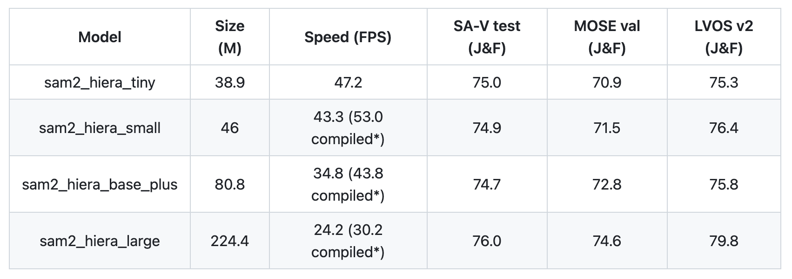
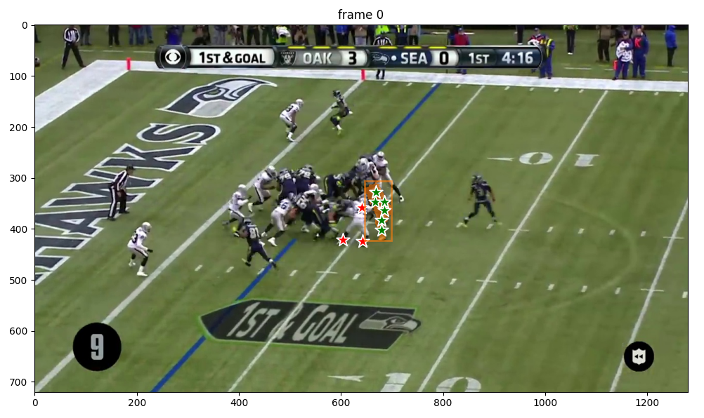
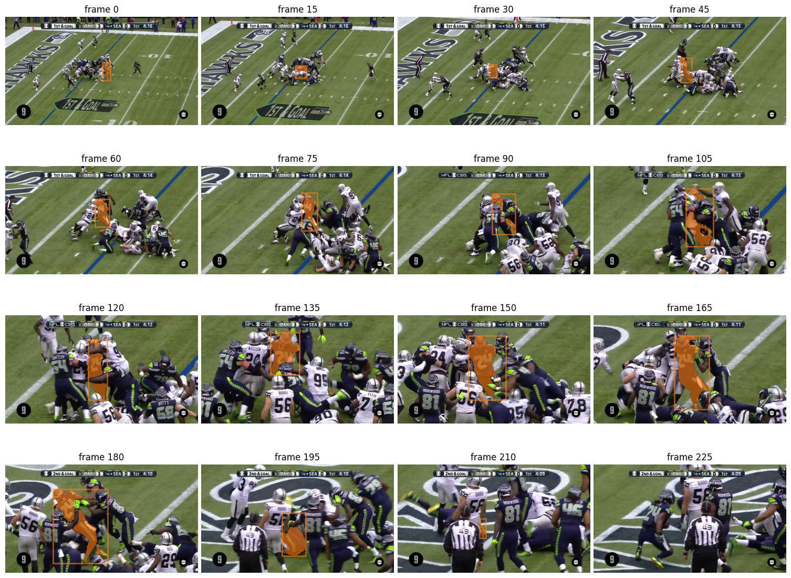
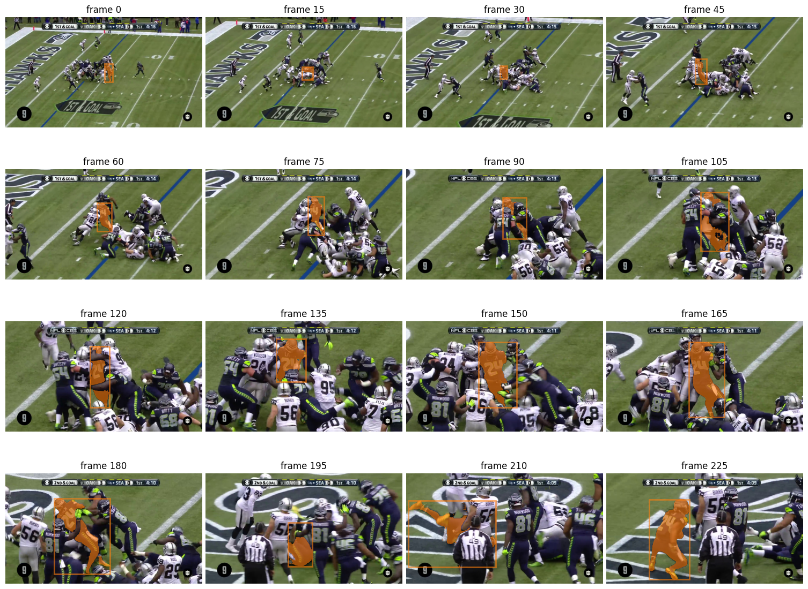

## SAM 2 Annotation Tool
##### (see the full notebook [here](/docs/SAM2_tool.fixed.html))  
  
  
**Project description:** In this project, I walk through a user-friendly tool that I created to accurately label a video for object tracking tasks.
  
The tool annotates the video by passing it through Meta's [SAM 2](https://ai.meta.com/sam2/) model and allowing a human-in-the-loop to correct its mistakes. SAM 2 is specifically designed for such a use case, as it is a *promptable* visual segmentation (PVS) model. Thus, before any object can be tracked, it must be identified in a given frame with a point(s), a bounding box, or a mask. After the initial prompt, SAM 2 will then track the object(s) throughout the video. If a given masklet is lost (e.g., from an occlusion), SAM 2 will require a new prompt in order to regain it.  

SAM 2's transformer-based architecture learns both motion- and appearance-based features and outperforms many of the top existing tracker models. Its promptable nature also makes it especially well-suited for providing initial high-fidelity labels that can be further refined with just a few clicks.  

### 1. Create the SAM 2 Predictor

First, load in an instance of the SAM 2 model. An <code>Inference State</code> is then set from the predictor with respect to the input video. For this walk-through, I demonstrate the capabilities of SAM 2 in tracking Marshawn Lynch throughout one of his touchdown runs. I also use the "tiny" version of SAM 2 here, though it also comes in "small", "base+", and "large".

### 2. Prompt SAM 2

Because SAM 2 is a promptable visual segmentation model, it cannot detect objects on its own but must be prompted with the object that it should segment and track. I created a user-friendly interface with which you can select points directly on the frame to isolate the object(s) of interest. First, you select the <code>Label</code> of the point, indicated by the color of its marker. A label of 0 means that the point is on the object (see 1 below), and a label of 1 means that it is *not* on the object (see 1 below). Also, the <code>Object ID</code> feature of each clicked point lets you select masks for multiple objects. Here, however, we only segment one object so the ID is always 1 (thus explaining why there are only "1"s on the frame). In the image below, I positively label points on Marshawn Lynch (i.e., Object 1) and negatively label points on the defender next to him, thus ensuring that SAM 2 will begin with an accurate mask.

Given this prompt, SAM 2 returns a segmented mask for Lynch in this first frame. This mask will be the first entry in SAM 2's <b>memory bank</b> (as seen in the architecture above), where its spatial and semantic information will inform the mask's propagation throughout the video.
  
I also added a function that derives the implied bounding box from the mask. This is especially useful for providing labeled data that can be used to fine-tune and evaluate object detection and tracking models that are trained on bounding boxes.

  

### 3. Run Inference and Review the Output

After running inference, we can view the results of the model to see how well it tracked Lynch over the frames.

  
  
### 4. Refine SAM 2 with a New Prompt

As seen in the frames above, SAM 2 does a great job of maintaining Marshawn Lynch's masklet, even as he runs through defenders. However, in **frame 210**, we notice that the mask is reduced to only the crown of his helmet, even though his legs are seen in the air. Because of this, by the time he emerges victorious in **frame 225**, the masklet has been completely lost.  
  
The promptable nature of SAM 2 does not only allow us to instantiate masks, but also to *refine* its predictions at any point during the video. Therefore, we will provide the correct mask for frame 210 by selecting a new set of labeled points. Thus, SAM 2 can recalibrate the masklet that it will propagate and attain even higher accuracy.

### 5. Re-Run Inference for the Final Results
We then run inference with SAM 2 again, now with an initial prompt that tells it which object to track and a downstream prompt to provide a course-correction. SAM 2 is now able to successfully track Marshawn Lynch throughout his turbulent trip to the endzone.

  

The constant motion, sudden changes in direction, and presence of other players all add to the complexity of the scene. The accomplishment of such a difficult–and previously intractable–task demonstrates the robustness of SAM 2 and the bright future of spatiotemporal vision models for efficient video labeling, object tracking, and much more.
